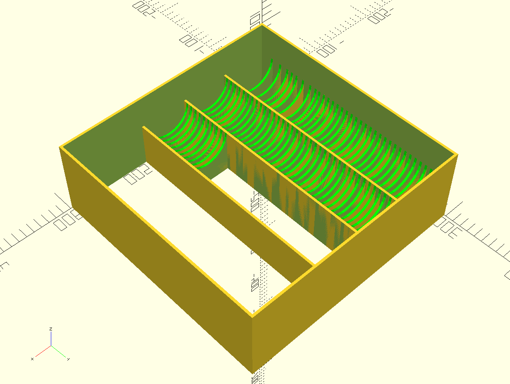

# Card Game Box Inlay 
 
## What is it?
This is a parametrizable box inlay for card games to separate stacks of cards. It will generate [openSCAD](https://openscad.org/) files in dependency of your 3D printer size. 
 
It is originally designed for Dominion (if you don't know it you have to try it!) and its expansions packs. There are currently 14 expansions with about 300 cards which have to stay sorted and I don't want so transport all of them to a game night. I've searched the internet but there was no solution which fits my needs, so I designed this inlay to separate stacks of cards and add additional trays.

## How to use it?
This is a Python script that generates openSCAD files with help of the [SolidPython](https://github.com/SolidCode/SolidPython) library. 
**IMPORTANT 1: openSCAD dimensions are unitless but gets interpreted as millimeter by most slicers.**
**IMPORTANT 2: I DON'T use Windows. Probably you have to set `openSCAD_export_stl` and `openSCAD_view` to `False`**

### Dependencies
#### openSCAD
In reference to the [download website of openSCAD](https://openscad.org/downloads.html):
##### MacOS
```
$ sudo port install openscad
```
or 
```
$ brew install openscad
```
##### Linux
You know how to use your package manager ;)

#### SolidPython
Install SolidPython with `pip install solidpython` and you're good to go.

### Change the parameter
Within the head of the script are parameters which you have to change for your needs:
#### card game values
```python
card_size = {"width":60, "height": 92, "thickness":0.24}
```
Dimensions of a single card with width, height and thickness. The default values are taken from the SKAT Standard which is popular in the EU.

```python
box_size = {"width": 298, "depth": 298, "height": 75}
```
Dimensions of the games container on the inside. Probably you should use some tolerance to your own to have a perfect fit.

```python
stack_count = [30, 40, 80, 5, 9, 24, 35, 30, 30, 20, 40, 40, 40]
```
Every list item is the number of cards in a stack of cards 

```python
cover_spacing = 5
```
This value is used to add space between the top of the cards and the lid of the box. For Dominion it is for label cards of the stacks.

```python
equal_stacks = {"stacks": 72, "count": 10} 
```
Adds the number of `stacks` to the end of `stack_count` with the count as `value`

#### indirect parameter
```python
output = "inlay.scad"
```
The path and file name of the output files.

```python
wall_thickness = 5
```
specifies the solid walls between every stack. Propably it depends on the capability of your printer.

```python
printer_size = {"x": 210, "y": 210, "z": 205} 
```
This value is the printing room of yout printer. The default values are taken from the Anycubic i3 Mega S because I own this model. ;)

```python
height_factor = 0.6
```
The factor defines the height of the spacer in relation of the card height 

```python
stack_tolerance = 2
```
Set the tolerance of a card stack in mm

#### programm flow parameter
```python
single_tray_only = False
```
This option is to test your cards fit in a tray. You don't need to print the whole inlay instead you can set it to `True` and get a single tray.

```python
openSCAD_export_stl = True
```
After the inlay is created a system call to openSCAD will export the model(s) to STL.

```python
openSCAD_view = True
```
After the inlay is created and (if set) exported a system call to openSCAD will view all models.

### create your inlay
- Change into the cloned directory and edit the desired parameters you have/want to change in `inlay.py`. Save the file.
- execute `python inlay.py`

## TODOs
- add a check size of the trays reach the limits of one box (error message or something similar). If the limits reached create a second box.

## Contribution
Feel free to fork this repo and send a merge request if you want.
